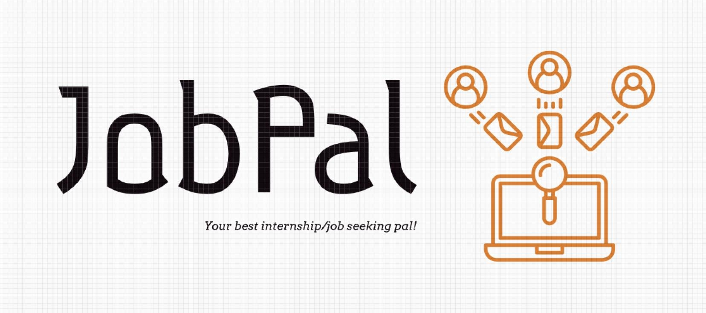

# JobPal

<!-- PROJECT LOGO -->

  

    <a href="https://youtu.be/9akIjycSzNw">View Demo</a>
  

<!-- TABLE OF CONTENTS -->

  
Table of Contents

  <ol>
    <li>
      <a href="#about-the-project">About The Project</a>
    </li>
    <li>
      <a href="#getting-started">Getting Started</a>
    </li>
    <li><a href="#top-contributors">Top contributors</a></li>
  </ol>

<!-- ABOUT THE PROJECT -->
## About The Project

This project is to construct an online job seeking and required skill learning web application to help nearly graduates to find jobs. This system consists of skill learning management, learning progress tracking and job interview tracking functionality.
Some of our classmates are going to graduate, what they are going to do next is finding a job. A job seeking application can help by seeking job opportunities, listing required skill and learning resources, and monitoring interview progress.  Even for those who already have a job, skill learning functionality can act as an auxiliary tool to self-improve. :muscle:

(<a href="#readme-top">back to top</a>)

<!-- GETTING STARTED -->
## Getting Started

In the project directory, you can run:

### `Yarn`

Install packages

### `Yarn start`

Runs the app in the development mode.\

Open [http://localhost:3000](http://localhost:3000) to view it in your browser.

The page will reload when you make changes.\
You may also see any lint errors in the console.

### `yarn test`

Launches the test runner in the interactive watch mode.\
See the section about [running tests](https://facebook.github.io/create-react-app/docs/running-tests) for more information.

### `yarn build`

Builds the app for production to the `build` folder.\
It correctly bundles React in production mode and optimizes the build for the best performance.

The build is minified and the filenames include the hashes.\
Your app is ready to be deployed!

See the section about [deployment](https://facebook.github.io/create-react-app/docs/deployment) for more information.

### `yarn eject`

**Note: this is a one-way operation. Once you `eject`, you can't go back!**

If you aren't satisfied with the build tool and configuration choices, you can `eject` at any time. This command will remove the single build dependency from your project.

Instead, it will copy all the configuration files and the transitive dependencies (webpack, Babel, ESLint, etc) right into your project so you have full control over them. All of the commands except `eject` will still work, but they will point to the copied scripts so you can tweak them. At this point you're on your own.

You don't have to ever use `eject`. The curated feature set is suitable for small and middle deployments, and you shouldn't feel obligated to use this feature. However we understand that this tool wouldn't be useful if you couldn't customize it when you are ready for it.

(<a href="#readme-top">back to top</a>)

<!-- TOP CONTRIBUTORS -->
## Top contributors

Sort by the first letter of the name:

* Pei-An (Charlotte), Chen
* Gueter Josmy Faure
* Steve Liu

(<a href="#readme-top">back to top</a>)

<!-- MARKDOWN LINKS & IMAGES -->
[React.js]: src/assets/images/React.png
[React-url]: https://reactjs.org/
[Node.js]: src/assets/images/Node-js.png
[Nodejs-url]: https://nodejs.org/en
[Vite]: src/assets/images/Vite.png
[Vite-url]: https://vite.dev/
[Vitest]: src/assets/images/Vitest.png
[Vitest-url]: https://vitest.dev/
[GitHubActions]: src/assets/images/GitHubActions.png
[GitHubActions-url]: https://github.com/features/actions
[Heroku]: src/assets/images/Heroku.png
[Heroku-url]: https://www.heroku.com/

